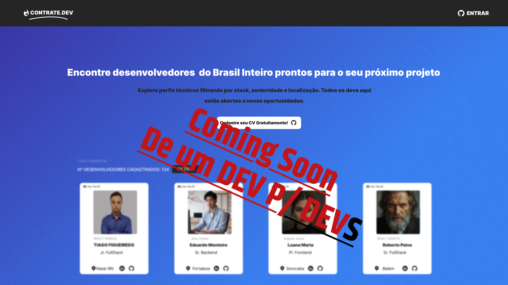

# 🛠️ Contrate.dev — Backend da Plataforma de Conexão entre Desenvolvedores e Oportunidades

## 🧠 Sobre o projeto

Este repositório representa o **Back-End** da aplicação **Contrate.dev** — uma plataforma 100% **gratuita** e **open-source** que conecta **Pessoas** a **desenvolvedores** que buscam **oportunidades reais** de trabalho!

A API foi construída com foco em **performance**, **segurança** e **escalabilidade**, utilizando autenticação via **GitHub OAuth**, banco de dados relacional, e práticas modernas de desenvolvimento com **TypeScript**, **Docker**, e **CI/CD com GitHub Actions**.

---

## 🔐 Funcionalidades da API

- 🚀 **Autenticação via GitHub OAuth 2.0**
- 👤 **Criação e gerenciamento de perfis de desenvolvedores**
- 🌎 Filtros por:
  - Stack principal
  - Localidade
  - Nível de senioridade
- 🔁 **Exibição aleatória de desenvolvedores**
- 📄 **Exportação de currículo em PDF**
- 🔗 **Geração de URLs únicas para compartilhamento de perfis**
- 🧪 **Testes automatizados com Jest**
- 🔄 **Integração contínua com GitHub Actions**

---

## 🖼️ Tecnologias utilizadas

| Back-End             | Ferramentas e Suporte       |
|----------------------|-----------------------------|
| 🟩 Node.js           | 🧪 Jest para testes          |
| 🟦 TypeScript        | 🐳 Docker para containerização |
| 🧬 Express.js        | ⚙️ CI/CD com GitHub Actions  |
| 🔐 JWT               | 🧾 Prisma ORM                |
| 🐘 PostgreSQL        | 🔑 OAuth com GitHub          |

---
prisma/schema
src/
├── controllers/
├── middlewares/
├── routes/
├── services/
├── utils/
└── tests/